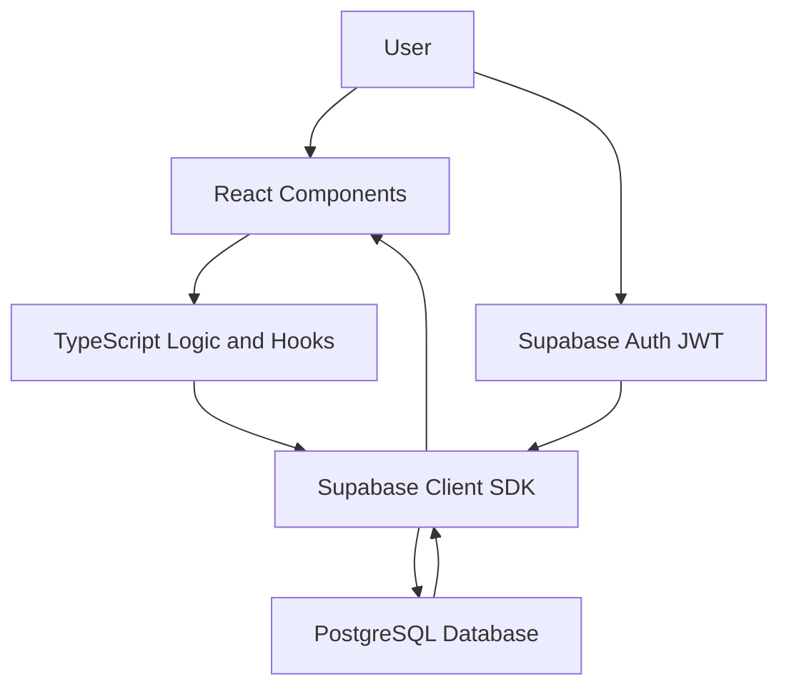

# Coffee ERP System

Coffee ERP is a specialized web application designed for managing coffee shop business processes. It automates inventory tracking and supply chain coordination, ensuring efficient logistics management.

## Key Features

- User Authentication: Secure user registration and login.
- **Inventory Dashboard**: Real-time management of ingredient stock levels.
- **Logistics Module**: Visual supply calendar, status tracking (In Transit, Delivered), and automated ETA calculation.
- **Analytics**: Analyzing stock usage trends and planning future procurement.
- **Interactive Interface**: Intuitive forms for updating order statuses and managing data.
  
## Architecture

The application follows a client-server architecture.

- Frontend: React + TypeScript single-page application built with Vite.
- Backend Services: Supabase for authentication and database operations.
- Database: PostgreSQL hosted by Supabase.
- Deployment: Vercel (free hosting with GitHub integration and automatic CI/CD).

The frontend communicates with Supabase through its client SDK to manage authentication and inventory data.
## Technologies Used

### Frontend
- **React**: Primary UI framework.
- **TypeScript**: Static typing for robust code.
- **Vite**: Build tool for fast development.
- **Tailwind CSS**: Responsive interface design.

### Backend & Database
- **Supabase** – backend-as-a-service (authentication, database, API)
- **PostgreSQL** – database engine

### DevOps & Infrastructure
- **Docker & Docker Compose**: Containerization for environment portability.
- **Git**: Version control.

### Key Dependencies
| Dependency | Purpose |
| --- | --- |
| `@supabase/supabase-js` | Client library for database operations and authentication |
| `react-icons` | Library for scalable UI icons |
| `recharts` | Library for building responsive data visualization charts |
| `sass` | Preprocessor for advanced CSS styling |
## Project Structure
```
COFFEE/
|-- public/              # Static assets
|-- src/
|   |-- assets/          # Icons and images
|   |-- components/      # UI components (Analytics, Auth, Logistics, ProductList)
|   |-- layout/          # Layout component
|   |-- App.tsx          # Main application component
|   |-- main.tsx         # Application entry point
|   |-- styles.scss      # Global styles
|   |-- supabaseClient.ts # Supabase configuration
|   `-- types.ts         # TypeScript definitions
|-- Dockerfile           # Build instructions
|-- docker-compose.yml   # Container configuration
|-- package.json         # Dependencies and scripts
`-- README.md            # Project documentation
```

## API & Database Integration
The application uses the Supabase JavaScript SDK to interact with the PostgreSQL database.
All data operations (CRUD) are performed through Supabase client methods, which internally communicate with the Supabase REST (PostgREST) API.

Example:
```ts
supabase.from("products").select("*")
```
Security (RLS)

The application uses Row Level Security (RLS) provided by Supabase.

This ensures that:

- users can only access their own data
- all database requests are validated using JWT authentication
- unauthorized access is automatically blocked at the database level

## Data Architecture


## Installation & Running Local Development
```
### Install dependencies
npm install

### Run in development mode
npm run dev
```
## Running with Docker
To run the project locally in an isolated environment using Docker
```
### Build and run containers
docker compose up --build
```
The application will be accessible at http://localhost:3000.

# Implementation – on free hosting (Vercel)

This project is deployed using a free hosting platform to ensure easy access and fast deployment without additional costs.

The application is hosted on **Vercel**, which provides seamless integration with GitHub and automatic deployments.

## Deployment Platform

The project is deployed on:

**Vercel**

## Live Demo

https://coffee-erp-six.vercel.app/

## How it was implemented

- Frontend built with React + Vite
- Authentication handled via Supabase
- Hosted using Vercel free tier
- Continuous deployment connected to GitHub repository

## Environment Variables (Vercel)

To run the project correctly, the following environment variables are required:

| Key | Description |
|-----|------------|
| VITE_SUPABASE_URL | Supabase project URL |
| VITE_SUPABASE_ANON_KEY | Supabase public API key |

## Supabase Configuration

In Supabase Dashboard:
Authentication → URL Configuration → Add your Vercel domain

Add:

https://coffee-erp-six.vercel.app

## Logic Highlights
The application uses strict typing for delivery statuses. Main statuses: In Transit, Delivered. The system automatically tracks transit time and updates dashboard information, ensuring data consistency. Testing the functionality has been verified through manual testing:

- Data retrieval from the database.
- Logistics module filter functionality.
- UI stability during status updates.
- Successful container startup via Docker.

## Project Goal

The goal of this project is to automate coffee shop operations including inventory management, logistics tracking, and analytics.

### Author 
**Yasmina Sarmanova** 
Semester project for the Web Application / IT Project course.
